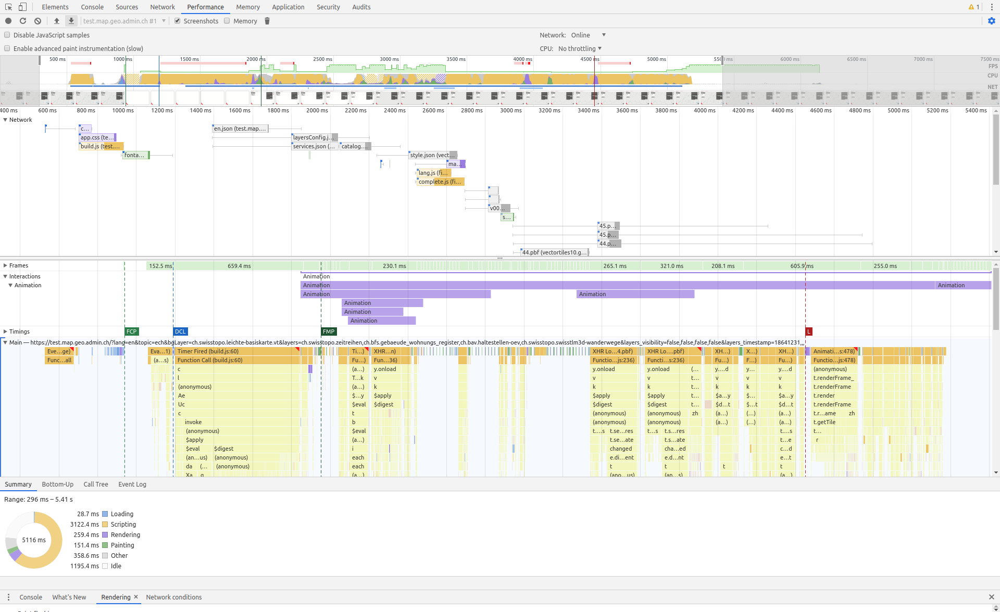
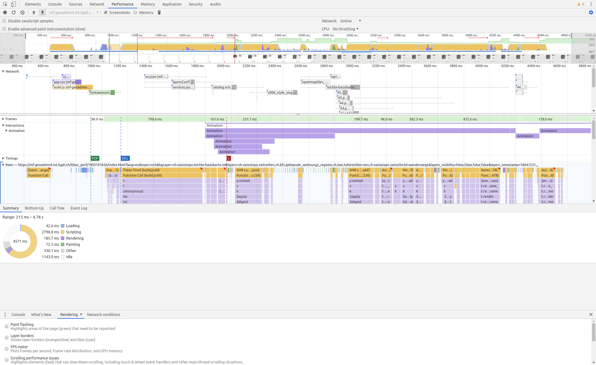
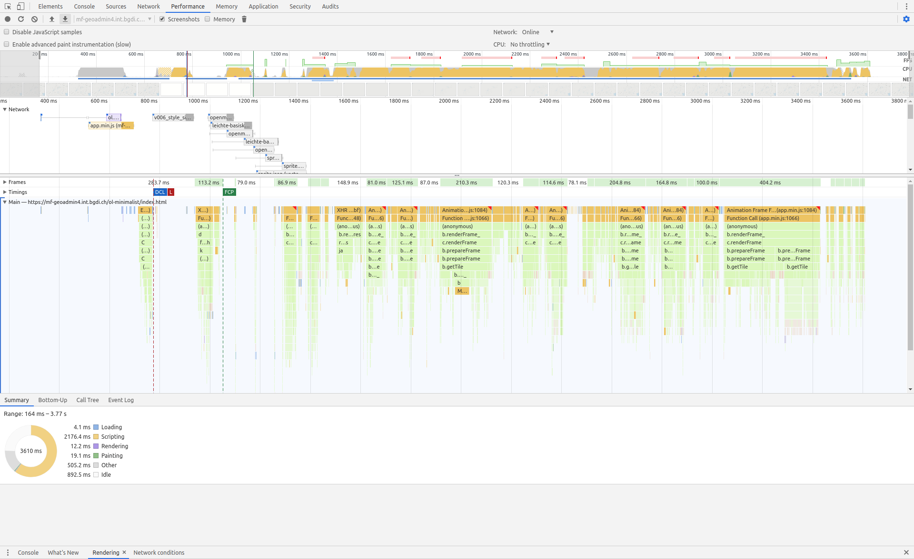
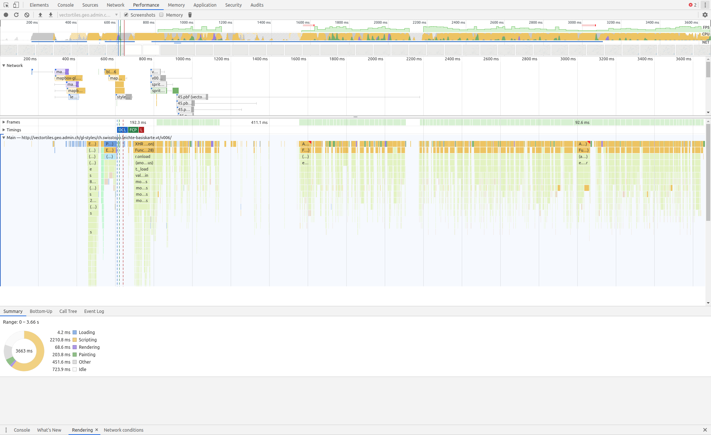

# Compare perfomance of mapbox and openlayers

*current test.map.geo.admin.ch https://test.map.geo.admin.ch*

*current testviewer but without hidden survey modal and customized style to only load from one domain vectortiles10. https://mf-geoadmin4.int.bgdi.ch/ltboc_perf/1903191626/index.html*

*minimalistic openlayers map viewer with swisstopo data source (loading tiles from one domain vectortiles10....) https://mf-geoadmin4.int.bgdi.ch/ol-minimalist/index.html*

*minimalistic mapbox map viewer with swisstopo data source (http://vectortiles.geo.admin.ch/gl-styles/ch.swisstopo.leichte-basiskarte.vt/v006/#7/47/8/0/6)*